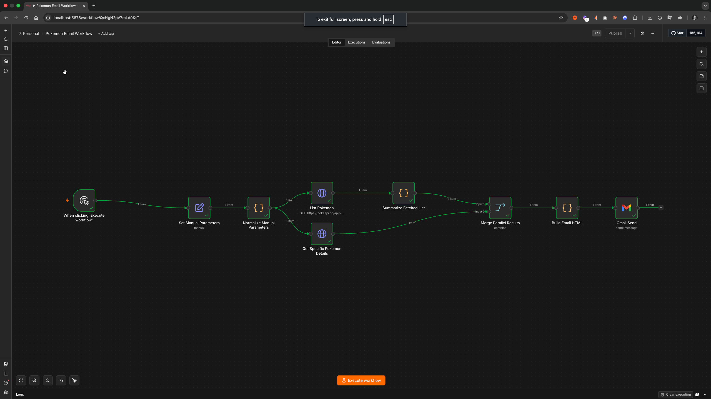
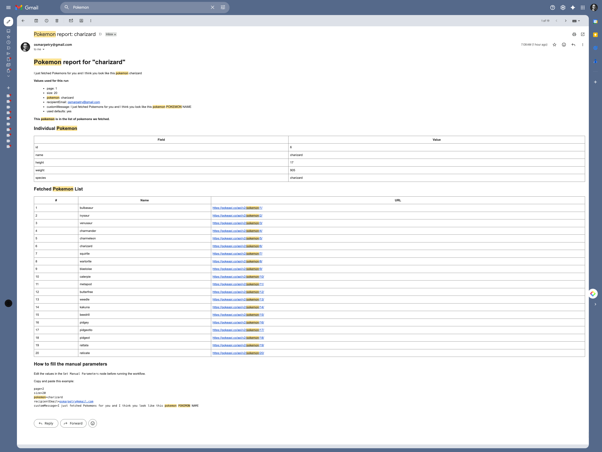

# n8n Product Engineer Take-Home Exercise

To review this submission, please clone my fork from `https://github.com/osmarpetry/n8n`

> git clone https://github.com/osmarpetry/n8n.git

I am providing the repository URL instead of a zip attachment because including the full repository with its Git data would make the submission roughly 1 GB.

I implemented a built-in `Pokemon` node for n8n that lets users list Pokemon and fetch one Pokemon by name or ID. This submission is packaged as `pokemon-node.patch` and includes the node implementation, targeted tests, and this write-up.

## TL;DR

- Chosen approach: I added a built-in `Pokemon` node in `packages/nodes-base` with two operations only: `Get Many` for listing Pokemon and `Get` for fetching one Pokemon by name or ID. I kept the node aligned with existing n8n node conventions instead of building a broader custom integration.
- Assumptions: I assumed a built-in node was the right delivery format, no authentication was needed because PokeAPI is public, one `Pokemon Name or ID` field was enough, and `Get Many` should return one n8n item per Pokemon for workflow usability.
- How I tested it: I validated the live API shape with `curl`, added automated tests with `NodeTestHarness` and `nock`, ran `pnpm test`, `pnpm lint`, `pnpm typecheck`, and `pnpm build`, and then ran a manual n8n workflow that used the new node together with Gmail.
- What I would do with more time: I would improve editor UX with a `resourceLocator` or load-options selector, add more pagination and error-path tests, and consider whether related Pokemon resources should be exposed in a later iteration.
- AI prompts used: I used GPT step by step to inspect existing node patterns, implement the node, validate response shapes, add tests, evaluate the list output tradeoff, understand how to validate the node with Gmail in a real workflow, and rewrite this submission clearly. The full prompt log is included below.
- Model used and why: I used OpenAI Codex, a GPT-5-based coding agent available in the workspace, because it was already integrated with the repo and terminal and made it easy to inspect patterns, edit files, run commands, and generate the patch in one place.

## Task understanding

The exercise asked for a built-in way to make [PokeAPI](https://pokeapi.co/) available in workflows, specifically so users can:

- `List Pokemon`
- `Get one Pokemon by name or ID`

It also asked for a patch submission that explains:

- approach
- assumptions
- testing
- what I would do with more time
- AI prompts used
- model used and why

I treated that scope literally. I implemented only the two requested user jobs and avoided turning this into a broader Pokemon integration.

## What I built

I added a built-in `Pokemon` node in `packages/nodes-base`.

Node surface:

- Resource: `Pokemon`
- `Get Many` maps to `List Pokemon` and calls `GET /api/v2/pokemon`
- `Get` maps to `Get one Pokemon by name or ID` and calls `GET /api/v2/pokemon/{nameOrId}`

Files in the patch:

- `packages/nodes-base/nodes/Pokemon/Pokemon.node.ts`
- `packages/nodes-base/nodes/Pokemon/GenericFunctions.ts`
- `packages/nodes-base/nodes/Pokemon/Pokemon.node.json`
- `packages/nodes-base/nodes/Pokemon/pokemon.svg`
- `packages/nodes-base/nodes/Pokemon/test/Pokemon.node.test.ts`
- `packages/nodes-base/nodes/Pokemon/test/Pokemon.workflow.test.json`
- `packages/nodes-base/package.json`
- `POKEMON_SUBMISSION.md`

## Why I kept the scope tight

The strongest signal in this exercise is disciplined execution against a small product requirement.

I intentionally did not add:

- extra PokeAPI resources such as species, types, or abilities
- custom credential handling
- advanced editor affordances like load-options or a `resourceLocator`

Those are reasonable next steps, but they are not required to satisfy the prompt. Keeping the node narrow made the solution easier to review, easier to validate, and more aligned with the timebox.

## Node UX and product-engineering decisions

Even though this task did not require new frontend components, I approached the node like a small design-system problem: reuse existing n8n interaction patterns, keep the UI minimal, and make the first-run experience obvious.

This was the hardest part of the exercise for me. The implementation itself was straightforward; the harder part was making sure the node behaved and read like an n8n node, not like a generic API wrapper, and then explaining that clearly in the write-up without drifting into abstract system-design language.

Key decisions:

- I used the standard n8n `Resource` / `Operation` structure instead of inventing a custom interface.
- I kept a single `Pokemon Name or ID` field because the API already accepts both forms and the user intent is a single job: "get a Pokemon".
- I added `Return All`, `Limit`, and `Offset` to `Get Many` because list operations in n8n are more useful when users can either fetch one page or everything.
- I returned one n8n item per Pokemon from `Get Many` instead of the raw `count/next/previous/results` envelope.
- I kept the node credential-free because the required endpoints are public.

The most important output-shaping decision was the list response. Returning one item per Pokemon makes the node immediately composable in downstream steps such as filtering, looping, merging, or sending email. Returning the raw wrapper object would preserve more API detail, but it would create extra work for workflow builders.

## Approach

I followed this sequence:

1. Inspect existing public API nodes in `packages/nodes-base` to match n8n conventions.
2. Verify the PokeAPI list and single-item response shapes before deciding the node contract.
3. Implement the node with a small shared request helper and response guards.
4. Add targeted automated tests with mocked HTTP responses.
5. Validate the node in the editor with a real workflow to confirm the output shape is practical.
6. Package the work as a patch file and document the tradeoffs.

## Commands I ran

### Repository setup

```bash
git clone https://github.com/n8n-io/n8n.git
cd n8n
pnpm install
pnpm build > build.log 2>&1
pnpm dev
```

### API verification

```bash
curl -s 'https://pokeapi.co/api/v2/pokemon?limit=2&offset=1' | jq
curl -s 'https://pokeapi.co/api/v2/pokemon/pikachu' | jq
curl -s 'https://pokeapi.co/api/v2/pokemon/25' | jq
```

### Package-level validation

```bash
pushd packages/nodes-base
pnpm test -- Pokemon.node.test.ts
NODE_OPTIONS='--max-old-space-size=8192' pnpm lint
pnpm typecheck
pnpm build > pokemon-build.log 2>&1
popd
```

## Testing and validation

### Automated testing

I added a node harness test using `NodeTestHarness` and mocked PokeAPI responses with `nock`.

Covered cases:

- `Get Many` with `limit=2` and `offset=1`
- `Get` with `pikachu`
- `Get` with `25`

This validates:

- the node calls the correct endpoints
- the node maps list results into one item per Pokemon
- name-based and ID-based lookup both work

Notes from validation:

- `pnpm lint` completed successfully after increasing the Node heap in this environment
- lint also printed existing repository warnings from validation scripts that were unrelated to the Pokemon node changes
- the package build completed successfully and generated updated node definitions

### Manual product validation

I also ran the node inside the editor as part of a small workflow smoke test.

Workflow used:

- Manual trigger
- set manual parameters
- list Pokemon
- get a specific Pokemon
- merge results
- build email HTML
- send through Gmail

Why I did this:

- to confirm the node is easy to configure in the editor
- to confirm the output shape is useful in a real workflow
- to validate the solution as a product surface, not just a code path

Two screenshots are attached with the submission:

- the workflow running in the n8n editor
- the resulting Gmail output

### Validation screenshots

#### Workflow validation



This screenshot shows the manual validation workflow in the editor. I used it to confirm that the node is easy to configure, that the output shape works in parallel branches, and that the returned data can be merged and passed into downstream nodes without extra cleanup.

#### Gmail output



This screenshot shows the final email generated from the workflow. I used it to validate that both the list output and the single-Pokemon output were practical in a real workflow, not only in unit tests.

## Assumptions

- A built-in node in `packages/nodes-base` is the right delivery format for "make PokeAPI available in workflows".
- No authentication is needed because the required endpoints are public.
- Supporting name and ID through one field is sufficient because PokeAPI already treats them as the same path parameter.
- Returning one item per Pokemon is the better default for workflow composition.

## Tradeoffs

- I optimized for the exact task scope rather than for broad API coverage.
- I chose a workflow-friendly list output over a raw API-faithful envelope.
- I kept the editor surface simple instead of adding richer lookup UX that would take more time to build and test.

## What I would do with more time

- Add a `resourceLocator` or load-options powered selector for Pokemon names to improve editor UX.
- Add a `Return All` test that spans multiple mocked pages.
- Add more error-path tests for malformed responses and API failures.
- Add docs collateral for the built-in node page if this were being prepared for merge.
- Revisit whether a future iteration should expose related resources such as species, types, or abilities.

## AI usage

### Model used

I used OpenAI Codex, a GPT-5-based coding agent available in the workspace environment.

### Why this model

It was already integrated with the repository and terminal, so I could inspect existing node patterns, edit files, run commands, validate results, and generate the patch from one place.

That mattered for this exercise because the useful part of AI here is not just code generation. It is fast repo orientation, pattern matching against existing code, and shorter feedback loops during validation.

### How I used AI

I used AI to accelerate implementation, but I validated decisions against real files, real commands, and real API responses. I did not treat model output as authoritative without checking it in the repo.

### Step-by-step prompts I used

I used GPT as a running copilot throughout the exercise. This is the chronological sequence of prompts that guided the work:

1. `Inspect existing public API nodes in packages/nodes-base and identify the closest pattern to use for a built-in PokeAPI integration.`
2. `Implement a new built-in Pokemon node with two operations: list Pokemon and get one Pokemon by name or ID. Keep the node consistent with n8n node conventions.`
3. `Verify the shape of the PokeAPI list and single-item endpoints before locking the output contract.`
4. `Add targeted automated tests using the existing node harness and mocked HTTP responses.`
5. `Review whether the list operation should emit one output item per Pokemon or the raw list envelope, and explain the tradeoff.`
6. `Show me how to validate this node in a real n8n workflow, including using the Gmail node to send myself the fetched Pokemon output.`
7. `Review the manual workflow from a product-engineering perspective and check whether the data shape is practical for downstream nodes.`
8. `Generate a submission patch and write submission notes covering approach, assumptions, testing, what I would do with more time, and AI usage.`
9. `Rewrite the submission so it is clear, easy to read, and reviewer-friendly. Emphasize the design-system and product-engineering decisions, not just the implementation steps.`

The Gmail-related prompt was useful because it forced one more level of validation: not only "does the node return data," but "does the returned data feel usable in an actual workflow built with existing n8n nodes."

## Closing note

If I were optimizing only for minimum implementation, I could have stopped after the node and the automated tests.

For a product-engineering take-home, I think the stronger signal is:

- clear scope control
- alignment with existing n8n UX patterns
- practical output design for workflows
- honest tradeoff discussion
- evidence of validation beyond "the code compiles"

That is the standard I aimed for in both the implementation and this submission.
